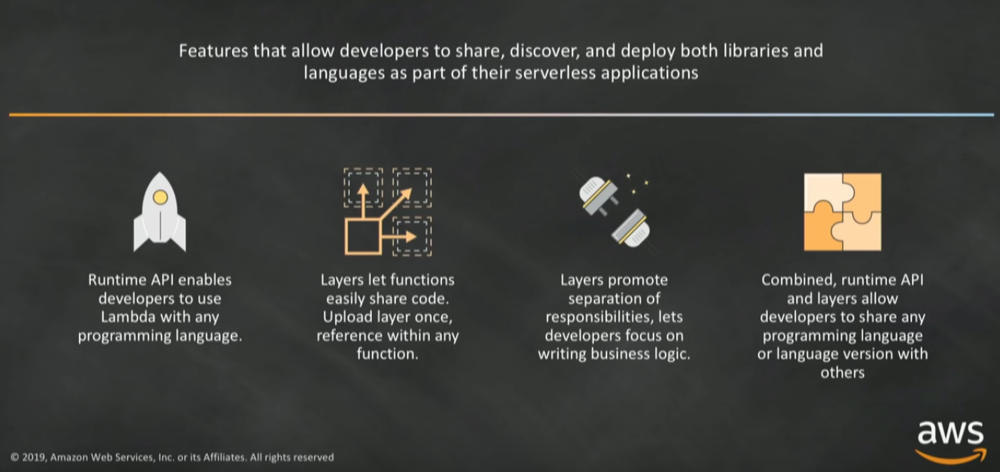
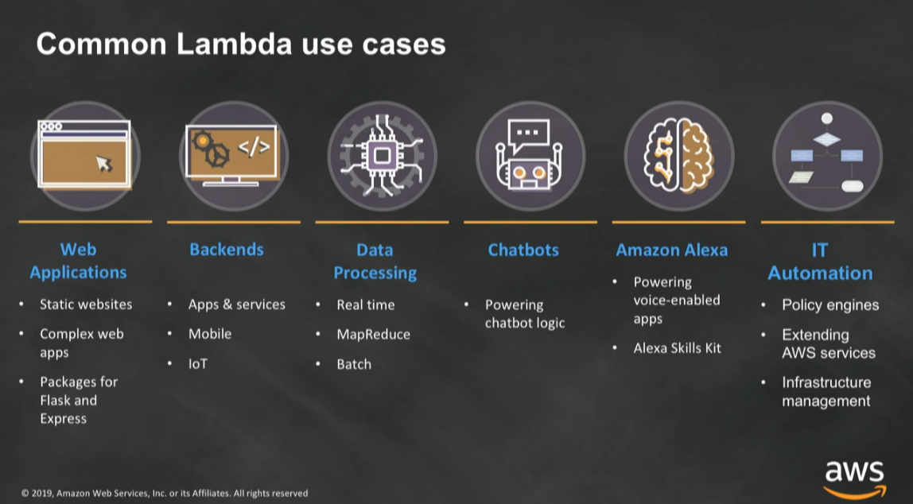

# INTRODUCTION TO AWS LAMBDA & SERVERLESS APPLICATONS

Notes from [AWS](https://www.youtube.com/watch?v=EBSdyoO3goc)

## SERVERLESS MEANS...

- No servers to provision or manage
- Pay for value
  - Don't pay for idle servers
- Scales with usage
- Availability and fault tolerance built in
- Greater agility
- Less overhead
- Better focus
- Increased scale
  - Data processing
- More flexibility
  - Ease of use
- Faster time to market

## LAMBDA SERVICES

(Been out since 2015)

Lambda handles:

- Load balancing
- Auto Scaling
- Handling Failures
- Security Isolation
- OS Management
- Managing Utilization
- Many other things

## SERVERLESS APPLICATIONS

EVENT SOURCE -> LAMBDA FUNCTION -> SERVICES

### EVENT SOURCE

- Changes in data state
- Requests to endpoints
- Changes in resource sstate

### LAMBDA FUNCTION

- Node.js
- Python
- Java
- C#
- Go
- Ruby
- Runtime API

### SERVICES

- Anything

## ANATOMY OF A LAMBDA FUNCTION

### HANDLER() FUNCTION

Function to be executed upon invocation

### EVENT OBJECT

Data sent during Lambda function Invocation

### CONTEXT OBJECT

Methods available to interact with runtime information (request ID, log group, more)

Example lambda function w/python:

```python
import json
def lambda_handler(event, context):
  # TODO implement
  return {
    'statusCode': 200,
    'body': json.dumps('Hello World!')
  }
```

## AWS LAMBDA RUNTIME API AND LAYERS

Feature that allow developers to share, discover, and deploy both libraries and languages as part of their serverless applications.

- Runtime API enables devlopers to use Lambda with any programming language
- Layers set functions easily share code. Upload layer once, reference within any function
- Layers promote separation of responsibilities, lets developers focus on writing business logic
- Combined, runtime API and layers allow developers to share any programming language or language version wih others



## FINE-GRAINED PRICING

- Buy compute time in 100ms increments
- Low request charge
- No hourly, daily, or monthly minimums
- No per-device fees
- Never pay for idle

## TWEAK YOUR FUNCTION'S COMPUTER POWER

Lambda exposes only a memory control, with the **% of CPU core and network capacity** allocated to a function proportionally. Is your code CPU, Network, or memory-bound? If so, it could be **cheaper** to choose more memory.

### SMART MEMORY ALLOCATION

- Match resource allocation (up to **3 GB!**) to logic
- State for Lambda funciton that calculates **1000 times** all prime numbers **<= 1000000**

|Memory|Time|Cost|
|------|----|----|
|128MB|11.722965sec|$0.024628|
|256MB|6.678945sec|$0.028035|
|512 MB|3.194954sec|$0.026830|
|1024 MB|1.465984sec|$0.024638|

We see that choosing 1024 MB shaved off **10.256981 seconds** at the extra cost of $0.00001. These are the tradeoffs.

## LAMBDA EXECUTION MODEL

### SYNCHRONOUS (PUSH)

Amazon API Gateway -> /order -> AWS Lambda function

### ASYNCRHONOUS (EVENT)

Amazon SNS / Amazon S3 -> Services -> AWS Lambda function

### POLL-BASED

Amazon DynamoDB / Amazon Kinesis / changes -> AWS Lambda service -> AWS Lambda function

## LAMBDA API

- API provided by the Lambda service
- Used by all other services that invoke Lambda across all models
- Supports sync and async
- Can pass any event payload structure you want
- Client included in every SDK

## LAMBDA PERMISSIONS MODEL

Fine grained security controls for both execution and invocation:

- **Execution policies:**
- Define what AWS resources/API calls can this function access via IAM
- Used in streaming invocations
- E.g. "Lambda function A can read from DynamoDB table users"
- **Function policies:**
- Used for sync and async invocations
- E.g. "Actions on bucket X can invoke Lambda function Z"
- Resource policies allow for cross account access

## COMMON LAMBDA USE CASES



## AMAZON API GATEWAY

- Create a unified API frontend for multiple micro-services
- DDoS protection and throttling for your backend
- Authenticate and authorize requests to a backend
- Throttle, meter, and monetize API usage by third-party developers