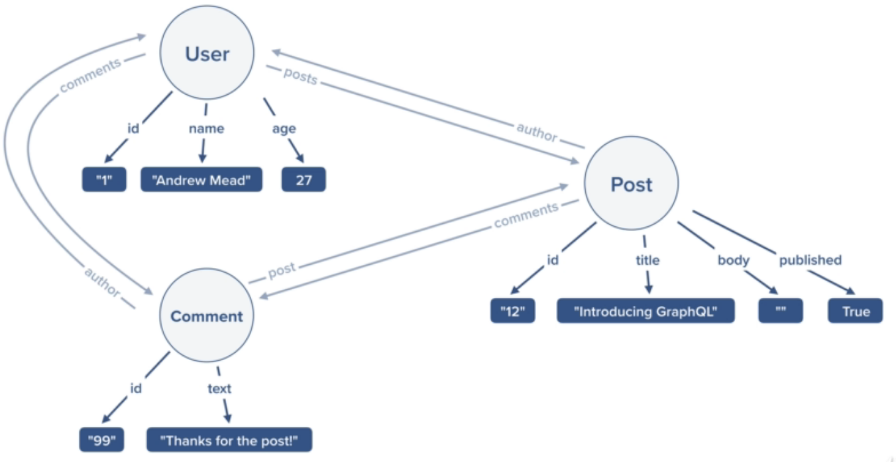
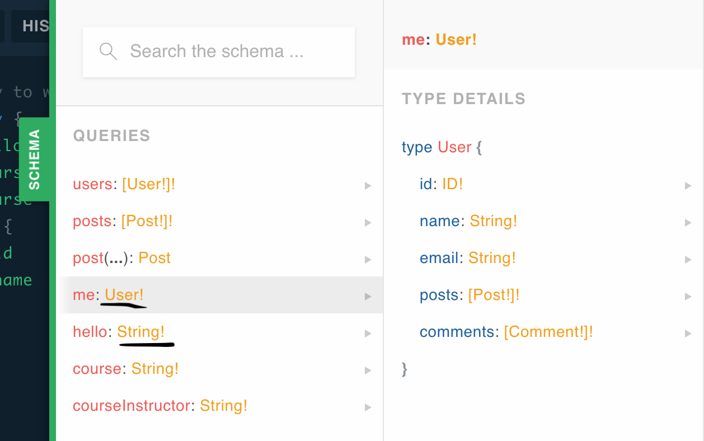

# THE MODERN GRAPHQL BOOTCAMP (W/NODE AND EXPRESS)

My notes from [Andrew Mead's Udemy Course](https://www.udemy.com/graphql-bootcamp/). Not paid or sponsored by this. I paid the full 12 bucks (• ε •).

[Link to code](https://github.com/peidansauyukjuk/udemy-graphql)

## TABLE OF CONTENTS

- [Why GraphQL?](#why-graphql)
- [What is a Graph?](#what-is-a-graph)
- [GraphQL Queries](#queries)
- [Nested Queries](#nested-queries)
- [Babel Setup](#babel-setup)
- [ES6 IMPORT/EXPORT](#es6-import-export)
- [Creating a GraphQL API](#creating-graphql-api)
- [GraphQL Scalar Types](#graphql-scalar-types)
- [Live Reload with Nodemon](#nodemon)
- [Operation Arguments](#operation-arguments)
- [Working with Arrays Part 1](#arrays-1)
- [Working with Arrays Part 2](#arrays-2)
- [Relational Data (Basics)](#relational-data)
- [Mutations](#mutations)
- [Input Type](#input-type)
- [Deleting Data with Mutations](#deleting-data)

## WHY GRAPHQL? <a name="why-graphql"></a>

1. GraphQL is fast
2. GraphQL is flexible
3. GraphQL is easy to use and simple to maintain

GraphQL stands for 'Graph Query Language.' We are mostly familiar with using a RESTful API in which we make HTTP requests to predictable URLs. This is either limiting in what information is provided or too liberal in giving too much information than needed.

GraphQL allows us to make requests to get exactly what we want.

Example requests to a REST API:

```
// to get post details
GET /posts/123

// to get posts by an author
GET posts?author=1234

// to get post comments
GET posts/123/comments
```

Example requests to a GraphQL API:

```
// get all three in one request
POST /graphql
```

## WHAT IS A GRAPH? <a name="what-is-a-graph"></a>

**Note**: a type in GraphQL is analogous to entity/table and a field in GraphQL is analogous to attribute/column.

A type has fields.

Example of a graph with three types (figure from Andrew Mead's course):



- There are three types here: User, Post, and Comment
- The User type has three fields: id, name, and age. Comment type has two, Post type has four
- A User **has many** Posts. A Post **belongs** to a User

## GRAPHQL QUERIES <a name="queries"></a>

Use this [GraphQL Playground](https://graphql-demo.mead.io/)

**Note**: remember there is only one end-point in GraphQL APIs so there's no need to change the URL.

Example query for playground: 

```
query {
  hello
}
```

This returns a response with JSON:

```
{
  "data": {
    "hello": "Hello World!"
    }
}
```

Another query:

```
query {
  hello
  courseInstructor
}
```

Response: 

```
{
  "data": {
    "hello": "Hello world!",
    "courseInstructor": "Andrew Mead"
  }
}
```

If you noticed, the playground autocompletes queries for you. This is because by nature all GraphQL APIs are self-documenting (pretty f'in amazing!). For REST APIs, there is usually someone who documents everything manually.

## NEST GRAPHQL QUERIES <a name="nested-queries"></a>

Use this [GraphQL Playground](https://graphql-demo.mead.io/)

The `me` type must have some subfields selected or else it will error out. We can use another set of curly braces to select the fields. If you click the schema tab and click `me`, you should see the available fields.

Query: 

```
query {
  hello
  course
  courseInstructor
  me {
    id
    name
  }
}
```

Response:

```
{
  "data": {
    "hello": "Hello world!",
    "courseInstructor": "Andrew Mead",
    "course": "GraphQL",
    "me": {
      "id": "79726ecd-84d5-4de7-bb9e-52fe3bfd9ef4",
      "name": "Andrew"
    }
  }
}
```

You might've noticed that the schema tab showed you something about the queries:



The exclamation mark means that you will always get that datatype returned. For `hello`, you will always get a string. Without the exclamation mark, you could get a string or null.

For `users:[User!]!`, it means we will get an array of users and it will always be an array of users. We will never get an array with an item of null.

## SETTING UP BABEL <a name="babel-setup"></a>

[Babel](https://babeljs.io/) is a JavaScript compiler that transforms the modern JS syntax into browser-compatible JS. For example, when we use arrow functions IE10 cannot interpret it. Babel converts the arrow function into a standard function expression in the background so IE10 can understand what we're writing.

In the terminal (make sure you're in the project folder):

```bash
# set up a package.json file
# y flag uses the default settings
npm init --y 

# installing babel cli version 6.26.0 (gives a command to pass JS through babel) 
# and babel-preset-env version 1.7.0 (process import/export. tells Babel what to change)
npm install babel-cli@6.26.0 babel-preset-env@1.7.0
```

We then create the file `.babelrc` in the project folder where we can configure Babel. At the end of the day, it is just a JSON file. (Don't give it the json extension though.)

In `.babelrc`:

```json
{
  "presets": [
    "env"
  ]
}
```

Babel configured and ready to go.

Create a folder named `src` in the project folder and add the file `index.js` in it. Then in `package.json`, add to the scripts like so:

```json
{
  "name": "udemy-graphql",
  "version": "1.0.0",
  "description": "",
  "main": "index.js",
  "scripts": {
    "start": "babel-node src/index.js",
    "test": "echo \"Error: no test specified\" && exit 1"
  },
  "keywords": [],
  "author": "",
  "license": "ISC",
  "dependencies": {
    "babel-cli": "^6.26.0",
    "babel-preset-env": "^1.7.0"
  }
}

```

This script will pass `index.js` through the Babel compiler. In the terminal, this will run `index.js`:

```bash
npm start
```

## ES6 IMPORT/EXPORT <a name="es6-import-export"></a>

In node, we are used to using modules with `require('module-name')`. We can use ES6 syntax and Babel to use the new `import` and `export` features in node.

In a new file `myModule.js`:

```javascript
// Named export - Has a name. Have as many as needed.
// Default export - Has no name, You can only have one.
const message = "I'm a message from myModule.js!";

const name = "Jojo"

const lastName = "Joestar"

export { message, name, lastName as default };
```


In `index.js`:

```javascript
// grabbing named exports
import { message, name } from './myModule';
// grabbing default export
import myLastName from './myModule';
// can also do the following:
// import myLastName, { message, name } from './myModule'

console.log(message);
console.log(myLastName);
```

If you run `npm start` in the terminal, you'll see the message from `myModule.js`.

## CREATING A GRAPHQL API <a name="creating-graphql-api"></a>

We are going to use `graphql-yoga` to implement GraphQL in our Node application.

```bash
npm i graphql-yoga@1.16.7
```

In our `index.js` (clean file), we need to import some tools from `graphql-yoga`. 

**Important**: type definitions and resolver names must match

```javascript
import { GraphQLServer } from 'graphql-yoga';

// Type definition (schema)
const typeDefs = `
  type Query {
    hello: String!
  }
`

// Resolvers
const resolvers = {
  Query: {
    // must match the type definition name
    hello() {
      return "This is my first query!";
    }
  }
}

const server = new GraphQLServer({
  typeDefs,
  resolvers
});

// this starts the server and it's default to http://localhost:4000/
server.start(() => {
  console.log('The server is up!')
})
```

## GRAPHQL SCALAR TYPES <a name="graphql-scalar-types"></a>

In GraphQL we have a couple of scalar types that really means that it is a type meant to store 1 piece of information.

GraphQL comes with a set of default scalar types out of the box (from [GraphQL docs](https://graphql.org/learn/schema/)):

- `Int`: A signed 32-bit integer
- `Float`: A signed double-precision floating-point value
- `String`: A UTF-8 character sequence
- `Boolean`: `true` or `false`
- `ID`: The ID scalar type represents a unique identifier, often used to refetch an object or as the key for a cache. The ID type is serialized in the same way as a String; however, defining it as an `ID` signifies that it is not intended to be human‐readable.

Example schema + queries:

```javascript
import { GraphQLServer } from 'graphql-yoga';

// Scalar Types - String, Boolean, Int, Float, ID (similar to a string)

// Type definition (schema)
const typeDefs = `
  type Query {
    title: String!
    price: Float!
    releaseYear: Int
    rating: Float
    inStock: Boolean!
  }
`

// Resolvers
const resolvers = {
  Query: {
    title(){
      return 'Hobbs and Shaw';
    },
    price(){
      return 25.95;
    },
    releaseYear(){
      return 2019;
    },
    rating(){
      return null;
    },
    inStock(){
      return true;
    }
  }
}

const server = new GraphQLServer({
  typeDefs,
  resolvers
});

server.start(() => {
  console.log('The server is up!')
})
```

## LIVE RELOAD USING NODEMON <a name="nodemon"></a>

Notice how everytime we make a change to our server we have to restart it? We can use the popular npm module `nodemon` to help us live reload the server every time we save.

```bash
# --save-dev for only development dependencies
npm install nodemon --save-dev
```

We have to make a change to our `npm start` script in `package.json`. We now run our script using `nodemon` and we have to specify that we want to do this through babel-node so we use the `--exec` flag.

```json
{
  "stuff": "stuff",
  "scripts": {
    "start": "nodemon src/index.js --exec babel-node",
    "test": "echo \"Error: no test specified\" && exit 1"
  },
  "stuff": "stuff"
}
```

## CUSTOM TYPES <a name="custom-types"></a>

We can use custom types that we define. The following is an example of creating the type Post and using it in our query:

```javascript
const typeDefs = `
  type Query {
    post: Post!
  }

  type Post {
    id: ID!
    title: String!
    body: String!
    published: Boolean!
  }
`

// Resolvers
const resolvers = {
  Query: {
    post() {
      return {
        id: '123asdad',
        title: 'Attack on Titans',
        body: 'Titans broke through Wall Maria',
        published: false
      }
    }
  }
}
```

When we query:

```graphql
query {
	post {
    id
    title
    body
    published
  }
}
```

we get a post object:

```json
{
  "data": {
    "post": {
      "id": "123asdad",
      "title": "Attack on Titan",
      "body": "Titans broke through Wall Maria",
      "published": false
    }
  }
}
```

## OPERATION ARGUMENTS <a name="operation-arguments"></a>

We can create parameters that will accept arguments in the query to pass along important information. For example, email for auth purposes.

We do this by defining what arguments we are looking to accept in the type definition. In the following, we are going to query `greeting` with the arguments `name` that's expecting a string, and `position` that's also expecting a string. If you wanted to make them a requirement, you just put an exclamation mark

```javascript
const typeDefs = `
  type Query {
    greeting(name: String, position: String): String!
  }
`

// if you want arguments to be required, use !
// const typeDefs = `
//   type Query {
//     greeting(name: String!, position: String): String!
//   }
// `
```

We're not done. We need to also change the resolver. Notice that a resolver has 4 parameters. We are going to focus on `args` for now.

```javascript
const resolvers = {
  Query: {
    greeting(parent, args, ctx, info) {
      if (args.name && args.position) {
        return `Hello ${args.name}! You are my favorite ${args.position}!`;
      } else {
        return 'Hello!'
      }
    }
}
```

I recommend you `console.log(args)` for yourself to see what it is. It is an object containing arguments passed in the query. Let's actually query this in our playground:

```graphql
query {
  greeting(name: 'Jojo', position: 'Stand User')
}
```

We get this back:

```json
{
  "data": {
    "greeting": "Hello Jotaro! You are my favorite Stand User!"
  }
}
```

## WORKING WITH ARRAYS PART 1 <a name="arrays-1"></a>

We can accept arrays as an argument or return an array by using the following syntax:

```javascript
const typeDefs = `
  type Query {
    add(numbers: [Float!]!): Float!
    grades: [Int!]!
  }
`
```

`grades: [Int!]!` means we expect an array to be returned and it will contain elements with type `Int`. Do note that an array can still be empty.

`add(numbers: [Float!]!): Float!` means that we require an array with elements of type `Float`. We expect a `Float` to be returned.

The resolver looks like this:

```javascript
const resolvers = {
  Query: {
    add(parent, args, ctx, info) {
      if (args.numbers.length === 0) {
        return 0;
      }
      return args.numbers.reduce((total, num) => total + num);
    },
    grades(parent, args, ctx, info) {
      return [99, 90, 88, 92];
    }
  }
}
```

## WORKING WITH ARRAYS PART 2 <a name="arrays-2"></a>

Here we are going to learn how to return an array of custom types. Here's an example using the type Post. First we initialize an array of posts.

```javascript
const posts = [
  {
    id: '1',
    title: 'Attack Titan',
    body: 'Eren is the Attack Titan',
    published: true
  },
  {
    id: '2',
    title: 'Armor Titan',
    body: 'Reiner is the Armor Titan',
    published: true
  },
  {
    id: '3',
    title: 'Colossal Titan',
    body: 'Armin is the Colossal Titan',
    published: true
  }
]
```

Now in our type definitions:

```javascript
// we are going to use the query argument to filter posts
const typeDefs = `
  query {
    posts(query: String): [Post!]!
  }
`
```

In our resolvers:

```javascript
const resolvers = {
  posts(parent, args, ctx, info) {
      if (args.query) {
        return posts.filter(post => {
          const isTitleMatch = post.title.toLowerCase().includes(args.query.toLowerCase());
          const isBodyMatch = post.body.toLowerCase().includes(args.query.toLowerCase())
          return isTitleMatch || isBodyMatch;
        });
      } else {
        return posts;
      }
    }
}
```

Let's go to our playground and do a query: 

```graphql
query {
	posts(query: "arm") {
		id
    title
    body
  }
}
```

We get back:

```json
{
  "data": {
    "posts": [
      {
        "id": "2",
        "title": "Armor Titan",
        "body": "Reiner is the Armor Titan"
      },
      {
        "id": "3",
        "title": "Colossal Titan",
        "body": "Armin is the Colossal Titan"
      }
    ]
  }
}
```

Sorry for the Attack on Titan spoilers (◕‿◕✿).

## RELATIONAL DATA (BASICS) <a name="relational-data"></a>

Here we'll learn how to set up relationships between our type definitions. For example, a post belongs to a user, and a user has many posts.

Let's visualize this with the graph from earlier.


With the graph, we can easily see the relationship between each type. We'll focus on the relationship between a user and a post.

First, let's set up the relationship for posts having an author. 

- Each post should have a property called `author` with the value of an ID.
- In our type definitions, a `Post` has the field `author` that points to a `User`.
- We need a new resolver called `Post`, **outside** of `Query`. In the `Post` resolver, we'll define an `author` function that finds the author. We have access to the post's author through the `parent` parameter.

```javascript
const posts = [
  {
    id: '1',
    title: 'Attack Titan',
    body: 'Eren is the Attack Titan',
    published: true,
    author: '1'
  },
  {
    id: '2',
    title: 'Armor Titan',
    body: 'Reiner is the Armor Titan',
    published: true,
    author: '2'
  },
  {
    id: '3',
    title: 'Colossal Titan',
    body: 'Armin is the Colossal Titan',
    published: true,
    author: '3'
  }
]

// Type definition (schema)
const typeDefs = `
  type Query {
    users(query: String): [User!]!
    posts(query: String): [Post!]!
    post: Post!
    me: User!
  }

  type User {
    id: ID!
    name: String!
    email: String!
    age: Int
  }

  type Post {
    id: ID!
    title: String!
    body: String!
    published: Boolean!
    author: User!
  }
`

// Resolvers
const resolvers = {
  Query: {
    users(parent, args, ctx, info) {
      if (args.query) {
        return users.filter(user => user.name.toLowerCase().includes(args.query.toLowerCase()))
      } else {
        return users;
      }
    },
    posts(parent, args, ctx, info) {
      if (args.query) {
        return posts.filter(post => {
          const isTitleMatch = post.title.toLowerCase().includes(args.query.toLowerCase());
          const isBodyMatch = post.body.toLowerCase().includes(args.query.toLowerCase())
          return isTitleMatch || isBodyMatch;
        });
      } else {
        return posts;
      }
    },
    me() {
      return {
        id: '123kmaskdas',
        name: "Joseph Joestar",
        email: "joestar@gmail.com",
        age: 35
      }
    },
    post() {
      return {
        id: '123asdad',
        title: 'Attack on Titans',
        body: 'Titans broke through Wall Maria',
        published: false
      }
    },
  },
  Post: {
    author(parent, args, ctx, info) {
      return users.find(user => {
        return user.id === parent.author;
      });
    }
  }
}
```

Here's the query:

```graphql
query {
  posts {
    title
    author {
      name
    }
  }
}
```

Here's the results:

```json
{
  "data": {
    "posts": [
      {
        "title": "Attack Titan",
        "author": {
          "name": "Giorno"
        }
      },
      {
        "title": "Armor Titan",
        "author": {
          "name": "Guido"
        }
      },
      {
        "title": "Colossal Titan",
        "author": {
          "name": "Leone"
        }
      }
    ]
  }
}
```

Now the other way. An author has posts.

**Note**: If one of our fields is not a scalar type, we have to set up a custom resolver function to teach GraphQL how to get the data.

Here's what we need to do:

- Define a `posts` field for User type
- Create a function in the `User` resolver to grab all posts related to the user

```javascript
const typeDefs = `
  type Query {
    users(query: String): [User!]!
    posts(query: String): [Post!]!
    post: Post!
    me: User!
  }

  type User {
    id: ID!
    name: String!
    email: String!
    age: Int
    posts: [Post!]!
  }

  type Post {
    id: ID!
    title: String!
    body: String!
    published: Boolean!
    author: User!
  }
`

const resolvers = {
  Query: {
    users(parent, args, ctx, info) {
      if (args.query) {
        return users.filter(user => user.name.toLowerCase().includes(args.query.toLowerCase()))
      } else {
        return users;
      }
    },
    posts(parent, args, ctx, info) {
      if (args.query) {
        return posts.filter(post => {
          const isTitleMatch = post.title.toLowerCase().includes(args.query.toLowerCase());
          const isBodyMatch = post.body.toLowerCase().includes(args.query.toLowerCase())
          return isTitleMatch || isBodyMatch;
        });
      } else {
        return posts;
      }
    },
    me() {
      return {
        id: '123kmaskdas',
        name: "Joseph Joestar",
        email: "joestar@gmail.com",
        age: 35
      }
    },
    post() {
      return {
        id: '123asdad',
        title: 'Attack on Titans',
        body: 'Titans broke through Wall Maria',
        published: false
      }
    },
  },
  Post: {
    author(parent, args, ctx, info) {
      return users.find(user => {
        return user.id === parent.author;
      });
    }
  },
  User: {
    posts(parent, args, ctx, info) {
      return posts.filter(post => post.author === parent.id);
    }
  }
}
```

## MUTATIONS <a name="mutations"></a>

Mutations allow us to create, update, and delete data.

Here's setting up the type defintion for creating a new user:

```javascript
const typeDefs = `
  ...

  type Mutation {
    createUser(name: String!, email: String!, age: Int): User!
  }
  
  ...
`
```

We'll be using an npm module called `uuid` to help us create random ID's. Just run `npm install uuid` in the terminal. Then import uuid version 4 it at the top of the `index.js` file: `import uuidv4 from 'uuid/v4`. Also install this npm module so we can use the spread operator: `npm install babel-plugin-transform-object-rest-spread`.

We don't need to import this, but we do need to add it to our `.babelrc` file like so:

```json
{
  "presets": [
    "env"
  ],
  "plugins": [
    "transform-object-rest-spread"
  ]
}
```

Now we're ready to go!

We're going to make sure the email doesn't already exist before creating a new user. Here's setting up the resolver:

```javascript
const resolvers = {
  ...Query,
  Mutation: {
    createUser(parent, args, ctx, info) {
      const emailExists = users.some(user => user.email === args.email);
      if (emailExists) {
        throw new Error('Email exists already.')
      }

      const user = {
        id: uuidv4(),
        ...args
      }
    }
  },
  ...otherResolvers
}
```

In GraphQL, this is how we create a new user:

```graph
mutation {
  createUser(name: "Johnathan", email: "jojojo@gmail.com") {
    id
    name
    email
  }
}
```

Response:

```json
{
  "data": {
    "createUser": {
      "id": "9bfb3e4c-8e7b-4952-921b-918c890a0b76",
      "name": "Johnathan",
      "age": null
    }
  }
}
```

## THE INPUT TYPE <a name="input-type"></a>

We notice that the `createUser` mutation has a bunch of fields that we need to fill in: name, email, age. As we continue to finish CRUD actions for a user, this will become repetitive. GraphQL provides us with a way to keep things DRY. We can use the `input` type. Start with the `input` keyword then followed by name `CreateUserInput` where the convention for the name is the action, object, input type.

```javascript
const typeDefs = {
  type Mutation {
    createUser(data: CreateUserInput): User!
  }

  input CreateUserInput {
    name: String!
    email: String!
    age: Int
  }
}
```

In our resolver, change the spread from `...args` to `...args.data` since the information now lives in `args.data`. Same for finding an email. Here:

```javascript
createUser(parent, args, ctx, info) {
      const emailTaken = users.some(user => user.email === args.data.email)
      if (emailTaken) {
        throw new Error('Email taken.')
      };

      const user = {
        id: uuidv4(),
        ...args.data
      };

      users.push(user);

      return user;
    }
```

To mutate in GraphQL:

```graphql
mutation {
  createUser(data: {
    name: "Johnathan"
    email: "jojojo@gmail.com"
  }) {
    id
    name
    email
  }
}
```

We cannot reference our other types inside an argument list. That's why we had to define a new type of `input` with scalar values.

## DELETING DATA WITH MUTATIONS <a name="deleting-data"></a>

